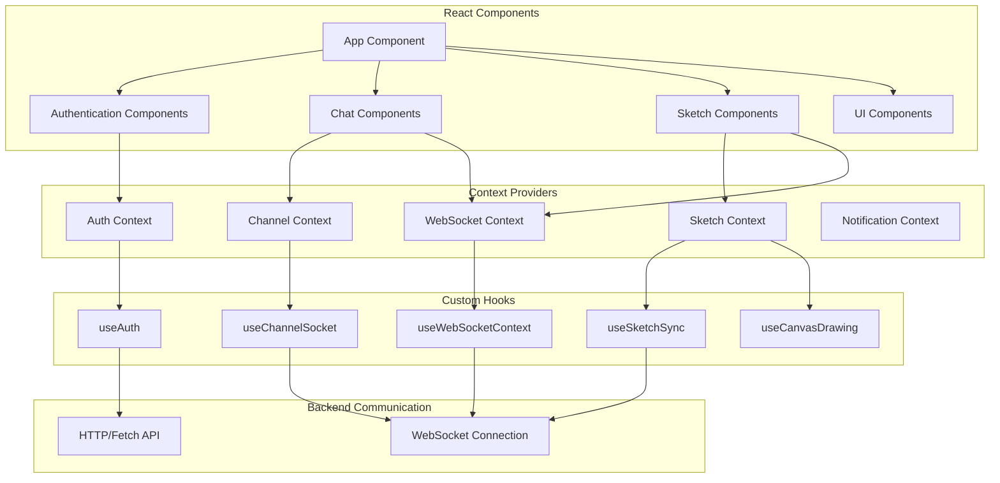
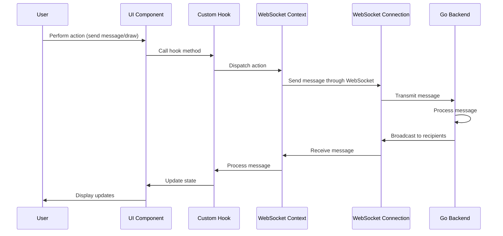
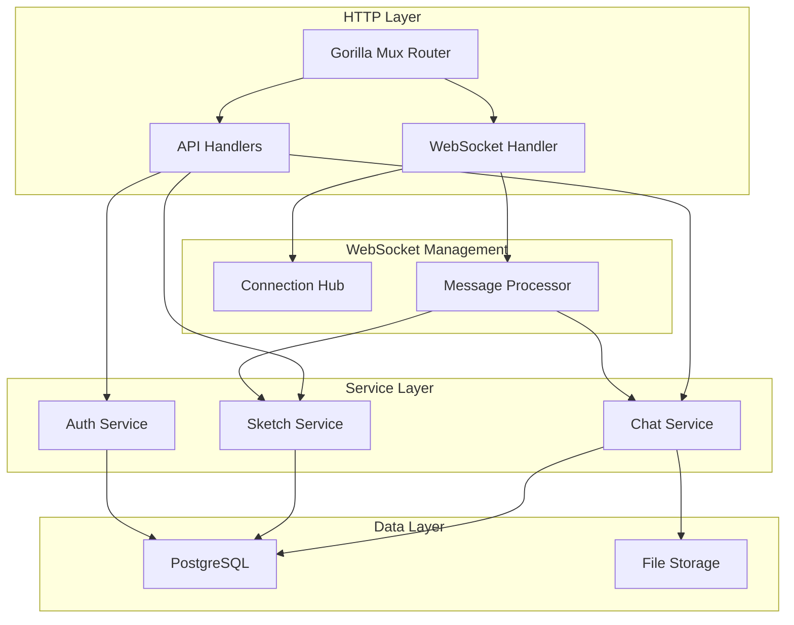
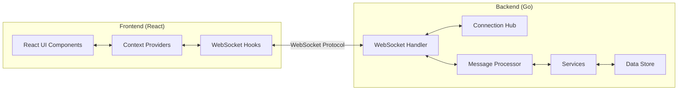

# Real-Time Chat and Sketch Application

## Objective:

Develop a real-time chat and collaborative sketch application using GoLang for server-side processing, WebSockets for real-time communication, and PostgreSQL for data persistence.

---

## Frontend Architecture

Modern React SPA featuring real-time chat and collaborative drawing functionality. Built with an emphasis on foundational web technologies and minimal dependencies.

### Tech Stack

- **Core**: React 18, TypeScript, Vite
- **State Management**: Context API + custom hooks (no Redux)
- **Styling**: TailwindCSS
- **Data Validation**: Zod
- **HTTP Client**: Axios
- **Testing**: Jest + React Testing Library

### Key Features

#### 1. Custom WebSocket Implementation

- Direct WebSocket API implementation, avoiding Socket.IO or similar libraries
- Custom hooks architecture for WebSocket lifecycle management:
  - `useWebSocketContext` manages global connection state
  - `useSystemSocket` handles system-wide events
  - `useChannelSocket` manages channel-specific messaging
  - `useSketchSync` coordinates real-time drawing events

#### 2. Real-Time Chat

- Event-based message system with typed payloads
- Optimistic UI updates for immediate feedback
- Presence tracking (online/offline status)
- Support for multiple channels with independent state

#### 3. Collaborative Sketching

- Built on native Canvas API without drawing libraries
- Supports real-time multi-user sketching
- Features include:
  - Drawing with customizable brush sizes and colors
  - Eraser tool with size control
  - Pan/zoom navigation
  - Color picker using react-colorful (only drawing-specific library)
- Implements custom stroke serialization/deserialization for networked drawing

#### 4. Custom Hook-Based Architecture

- Separation of concerns via specialized hooks:
  - `useAuth` for authentication flow
  - `useCanvasDrawing` for canvas operations
  - `useSketchManager` for drawing state and event management
  - `useNotification` for system notifications

### Code Organization

```
src/
├── api/          # API clients and endpoints
├── components/   # UI components organized by feature
├── contexts/     # Context definitions and providers
├── hooks/        # Custom hooks for logic separation
├── providers/    # Combined context providers
├── services/     # Standalone service modules
├── styles/       # Global styles and theming
├── types/        # TypeScript interfaces and types
└── utils/        # Utility and helper functions
```

### Avoided External Libraries

- **State Management**: Built without Redux, MobX, Zustand, or Recoil
- **UI Components**: No Material UI, Chakra UI, or other component libraries
- **Drawing**: No D3, Fabric.js, Paper.js, or other canvas libraries
- **WebSockets**: No Socket.IO, SockJS, or other WebSocket abstractions
- **Form Management**: No React Hook Form, Formik, or other form libraries
- **Routing**: No React Router (single-page application)

### Technical Highlights

- **Strongly Typed**: Comprehensive TypeScript coverage with custom type definitions
- **Custom WebSocket Protocol**: Implemented domain-specific WebSocket message protocol
- **Optimized Re-renders**: Strategic component memoization and state isolation
- **Error Handling**: Robust error boundaries and fallback UI
- **Performance**: Efficient drawing algorithms for smooth sketching experience

### Application Screenshot


### Frontend Architecture Diagram



### WebSocket Communication Flow



---

## Backend Architecture

The backend is a Go application designed with a focus on concurrency, performance, and maintainability. It leverages Go's native concurrency primitives and minimal external dependencies.

### Tech Stack

- **Language**: Go 1.23
- **Web Framework**: Minimal, built on standard library and Gorilla Mux
- **Database**: PostgreSQL (with native SQL, no ORM)
- **WebSockets**: Gorilla WebSocket
- **Auth**: Custom JWT-less token authentication
- **File Storage**: Local filesystem with custom abstraction

### Key Features

#### 1. Channel-Based WebSocket Architecture

- Custom implementation of a connection hub managing multiple WebSocket channels
- Real-time message broadcasting with fine-grained recipient control
- Concurrent message processing with goroutines
- Automatic stale connection cleanup

#### 2. Custom Message Protocol

- Type-based message processing system
- Bidirectional binary and text message support
- Structured error handling and validation

#### 3. Database Layer

- Custom SQL query builder (no ORM)
- Explicit transaction management
- Database migrations and schema versioning
- Connection pooling for optimal performance

#### 4. Robust Authentication

- Custom token-based authentication system
- Password hashing with bcrypt
- Session management without external dependencies

### Code Organization

```
backend/
├── cmd/               # Application entry points
│   └── server/        # Main server executable
├── internal/          # Private application code
│   ├── auth/          # Authentication logic
│   ├── config/        # Configuration management
│   ├── connections/   # WebSocket hub and connection management
│   ├── messaging/     # Message processing system
│   ├── models/        # Data structures
│   ├── services/      # Business logic by domain
│   │   ├── chat/      # Chat functionality
│   │   └── sketch/    # Sketch functionality
│   ├── store/         # Data persistence
│   │   ├── database/  # Database operations
│   │   └── storage/   # File storage operations
│   └── websocket/     # WebSocket handling
└── pkg/               # Public libraries
    ├── api/           # API routes and handlers
    └── utils/         # Utility functions
```

### Backend Architecture Diagram



### End-to-End Communication Diagram



### API Documentation

The backend exposes both RESTful HTTP endpoints and WebSocket connections for real-time communication:

#### REST API Endpoints

| Method | Endpoint                                              | Description                            |
| ------ | ----------------------------------------------------- | -------------------------------------- |
| POST   | `/api/register`                                       | Register a new user                    |
| POST   | `/api/login`                                          | Login and receive auth token           |
| GET    | `/api/validateToken`                                  | Validate authentication token          |
| PATCH  | `/api/logout`                                         | Logout user                            |
| DELETE | `/api/deleteAccount`                                  | Delete user account                    |
| GET    | `/api/channels`                                       | List available channels                |
| POST   | `/api/createChannel/{channelName}`                    | Create a new channel                   |
| DELETE | `/api/deleteChannel/{channelName}`                    | Delete a channel                       |
| PATCH  | `/api/joinChannel/{channelName}`                      | Join a channel                         |
| PATCH  | `/api/leaveChannel/{channelName}`                     | Leave a channel                        |
| GET    | `/api/channels/{channelName}/members`                 | Get channel members                    |
| PATCH  | `/api/channels/{channelName}/members/{username}/role` | Update member role                     |
| GET    | `/api/getMessages/{channelName}`                      | Get channel messages                   |
| POST   | `/api/upload`                                         | Upload a file                          |
| GET    | `/api/onlineUsers/{channelName}`                      | Get online users in channel            |
| GET    | `/api/onlineUsersCount`                               | Get count of all online users          |
| POST   | `/api/createSketch`                                   | Create a new sketch                    |
| GET    | `/api/channels/{channelName}/sketches`                | List sketches in a channel             |
| GET    | `/api/channels/{channelName}/sketches/{sketchId}`     | Get sketch details                     |
| DELETE | `/api/deleteSketch/{sketchId}`                        | Delete a sketch                        |
| POST   | `/api/clearSketch`                                    | Clear a sketch                         |
| GET    | `/api/files/*`                                        | Access uploaded files (token required) |

#### WebSocket Connections

| Endpoint                    | Description                                                         |
| --------------------------- | ------------------------------------------------------------------- |
| `/ws/system`                | System-level WebSocket for user presence and notifications          |
| `/ws/channel/{channelName}` | Channel-specific WebSocket for messages and collaborative sketching |

Authentication uses a custom token system passed via Authorization header for REST APIs and as a query parameter for WebSocket connections.

---

## Deployment Architecture

The application is containerized using Docker and deployed on Fly.io.

### Containerization

- Multi-stage Docker builds for optimized image sizes
- Docker Compose for local development and testing
- PostgreSQL container with volume persistence

### Deployment

- Manual deployment to Fly.io using the Fly CLI
- PostgreSQL managed instance on Fly.io
- Automatic SSL certificate provisioning
- Simple horizontal scaling capabilities

The application uses a straightforward deployment model without complex CI/CD pipelines, making it easy to maintain as a portfolio project.

---

## Scalability & Future Improvements

While the current architecture provides a solid foundation, several enhancements could improve scalability and performance for enterprise-level deployments:

### Distributed WebSocket Architecture

- **Redis Pub/Sub**: Implement Redis as a message broker to synchronize WebSocket messages across multiple application instances
- **Sticky Sessions**: Configure load balancers to maintain session affinity for WebSocket connections
- **Connection Pooling**: Implement WebSocket connection pooling for more efficient resource utilization

### Database Optimizations

- **Read Replicas**: Add PostgreSQL read replicas to distribute query load
- **Sharding Strategy**: Implement horizontal sharding based on channel/tenant to distribute write operations
- **Query Optimization**: Add database indexing and query optimization for high-traffic patterns
- **Connection Pooling**: Enhance database connection management with advanced pooling strategies

### Caching Architecture

- **Redis Cache Layer**: Implement multi-level caching for frequently accessed data
- **Cache Invalidation**: Develop a sophisticated cache invalidation strategy using version tags
- **Channel Data Caching**: Cache channel membership and presence information to reduce database load

### Scalability Enhancements

- **Microservices Migration**: Split monolithic backend into specialized microservices (Auth, Messaging, Sketching)
- **Event-Driven Architecture**: Implement event sourcing and CQRS patterns for better scaling
- **Kubernetes Deployment**: Migrate to Kubernetes for advanced orchestration and auto-scaling
- **Global CDN**: Implement CDN for static assets and optimized global content delivery

### Monitoring & Reliability

- **Distributed Tracing**: Implement OpenTelemetry for end-to-end request tracing
- **Circuit Breakers**: Add resilience patterns to handle service degradation gracefully
- **Chaos Engineering**: Implement controlled failure testing to ensure system resilience

This scalability roadmap would allow the application to handle millions of concurrent users while maintaining low latency and high availability across global regions.
