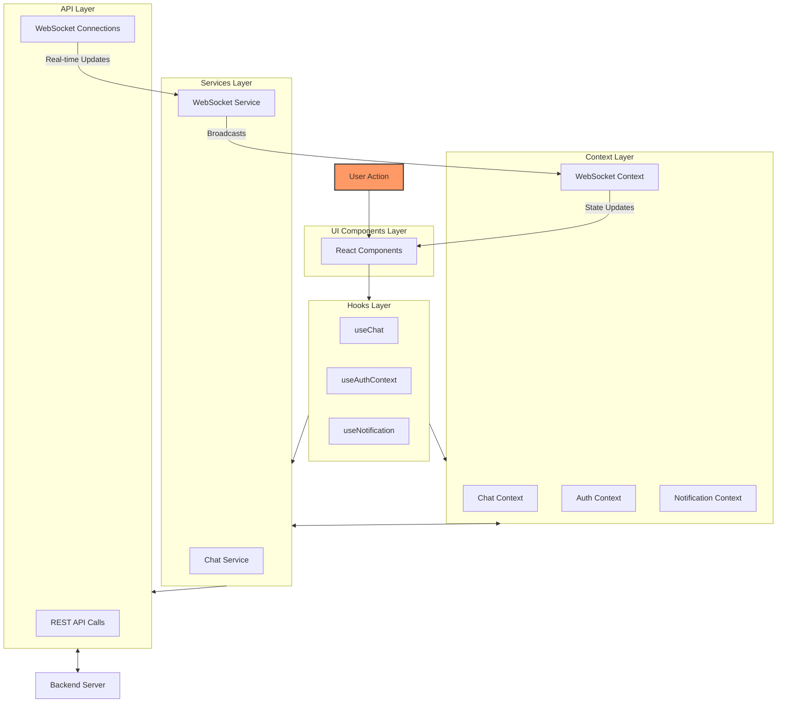

# Frontend Architecture

## Overview

The frontend architecture follows a clean separation of concerns with a service-oriented approach. The main components are:

1. **API Layer**: Handles direct HTTP requests to the backend with Zod validation
2. **Services Layer**: Provides singleton services with business logic and caching
3. **Contexts**: Provide state management throughout the application
4. **Hooks**: Custom React hooks that connect services and contexts to components
5. **Components**: UI elements that consume hooks and contexts

## Architecture Diagram



## Architecture Layers

### 1. API Layer

Located in `src/api/`, this layer contains direct API calls to the backend.

- `chatApi.ts`: Handles REST API calls for chat-related functionality with validation using Zod
- `axiosInstance.ts`: Configures the Axios instance with interceptors and common settings

API calls follow a consistent pattern with proper error handling:

```typescript
// Example from chatApi.ts
joinChannel: async (channelName: string, token: string, password?: string): Promise<string[]> => {
  const res = await axiosInstance.patch(
    `${BASE_URL}/joinChannel/${encodeURIComponent(channelName)}`,
    { password: password || "" },
    { headers: { Authorization: `Bearer ${token}` } }
  );

  if (!res.data.success) {
    throw new Error(`Failed to join channel: ${res.data.error}`);
  }

  // Return online users from the response
  return res.data.data.onlineUsers || [];
};
```

### 2. Services Layer

Located in `src/services/`, this layer implements the singleton pattern and manages:

- **State Caching**: In-memory caches for channels and messages
- **Business Logic**: Implementation of domain-specific logic
- **API Integration**: Connection between frontend and backend
- **Data Formatting**: Handles case conversion between frontend and backend formats

Key services:

- `ChatService.ts`: Manages channel operations, message fetching, and caching
- `WebSocketService.ts`: Handles WebSocket connections and message formatting
- `SketchService.ts`: Manages sketch operations, caching, and synchronization

Service implementation highlights:

```typescript
// ChatService is a singleton with caching
export class ChatService {
  private static instance: ChatService;
  private cachedChannels: Channel[] | null = null;
  private channelMessagesCache: Record<string, IncomingMessage[]> = {};

  // Provides a central access point
  public static getInstance(): ChatService { ... }

  // Methods for channel/message operations with cache management
  public async fetchChannels(token: string, forceRefresh = false): Promise<Channel[]> { ... }

  // Returns online users when joining a channel
  public async joinChannel(channelName: string, token: string, password?: string): Promise<string[]> {
    return await chatApi.joinChannel(channelName, token, password);
  }
}
```

### 3. Context Layer

Located in `src/contexts/`, this layer provides application-wide state.

- `webSocketContext.ts`: Manages WebSocket connections state and actions
- `chatContext.ts`: Provides chat-related state and actions
- `authContext.ts`: Handles authentication state
- `notificationContext.ts`: Manages notifications
- `sketchContext.ts`: Manages sketch list and current sketch selection

Each context follows a consistent pattern with clearly defined state and actions:

```typescript
export interface ChatContext {
  state: {
    messages: Record<string, IncomingMessage[]>;
    channels: Channel[];
    currentChannel: string | null;
    isLoading: boolean;
    errors: Record<string, Error | null>;
    connectionState: {
      systemConnected: boolean;
      channelConnected: boolean;
    };
    onlineUsers: Record<string, Set<string>>; // channelName -> Set of online usernames
  };
  actions: {
    sendMessage: (message: OutgoingMessage) => void;
    joinChannel: (channelName: string, password?: string) => Promise<boolean>;
    createChannel: (channelName: string, description?: string, password?: string) => Promise<boolean>;
    deleteChannel: (channelName: string) => Promise<boolean>;
    leaveChannel: (channelName: string) => Promise<boolean>;
    fetchChannels: () => Promise<Channel[] | null>;
    updateMemberRole: (channelName: string, username: string, isAdmin: boolean) => Promise<boolean>;
    uploadFile: (channelName: string, file: File, messageText?: string) => Promise<boolean>;
  };
}
```

### 4. Hooks Layer

Located in `src/hooks/`, these custom hooks abstract away complex logic and state management.

- `useChat.ts`: Core hook that orchestrates chat functionality
  - Manages channels, messages, and WebSocket interactions
  - Implements rate limiting and error handling
  - Provides a clean API for components
  - Handles user online status tracking
- `useAuthContext.ts`: Simplifies authentication interactions
- `useNotification.ts`: Manages user notifications
- `useSketch.ts`: Orchestrates sketch drawing functionality
- `useSketchState.ts`: Manages drawing state and path tracking
- `useSketchSync.ts`: Handles real-time sketch synchronization
- `useCanvasDrawing.ts`: Handles canvas rendering operations

The `useChat` hook is central to the implementation and follows a clear initialization flow:

1. Connects to the system WebSocket
2. Fetches available channels
3. Restores the previous channel if available
4. Fetches messages for the current channel
5. Maintains online user presence information

### 5. UI Components Layer

Located in `src/components/`, this layer contains React components that:

- Connect to hooks and contexts
- Render UI based on application state
- Handle user interactions

## Data Flow

1. **User Action**: Component captures user interaction (e.g., click on "Send Message")
2. **Hook Call**: Component calls a hook method (e.g., `chat.actions.sendMessage`)
3. **Service Execution**: Hook delegates to the appropriate service (e.g., `WebSocketService.send`)
4. **Message Formatting**: Service converts message format (camelCase to snake_case)
5. **WebSocket Send**: Formatted message sent through appropriate socket
6. **Backend Processing**: Server processes message and broadcasts to relevant clients
7. **Message Receipt**: WebSocket service receives message and converts format (snake_case to camelCase)
8. **State Update**: Hook updates state based on received message
9. **Re-render**: Components receive updated state and re-render

### WebSocket Architecture

The WebSocket implementation follows a clear separation of concerns:

1. **Socket Types**:

   - **System Socket**: Only handles channel creation/deletion updates
   - **Channel Socket**: Handles all channel-specific messages (text, image, sketch, member updates, user status)

2. **Message Flow**:

   ```typescript
   // Outgoing message flow
   Component -> Hook -> WebSocketService.send() -> convertKeysToSnakeCase() -> WebSocket

   // Incoming message flow
   WebSocket -> handleIncomingMessage() -> convertKeysToCamelCase() -> MessageHandler -> State Update
   ```

3. **Message Types**:

   - Channel Socket Messages:
     - Text messages
     - Image messages
     - Sketch messages
     - Member updates (join/leave/role changes)
     - User status updates (online/offline)
   - System Socket Messages:
     - Channel creation
     - Channel deletion

4. **Case Conversion**:

   - Frontend uses camelCase (e.g., `channelName`)
   - Backend uses snake_case (e.g., `channel_name`)
   - Automatic conversion in WebSocketService:

     ```typescript
     // Sending
     const snakeCaseMessage = convertKeysToSnakeCase(message);
     socket.send(JSON.stringify(snakeCaseMessage));

     // Receiving
     const rawMessage = JSON.parse(event.data);
     const message = convertKeysToCamelCase(rawMessage);
     ```

5. **Connection Management**:
   - Automatic reconnection with retry limits
   - Connection state tracking
   - Clean disconnection handling

## User Presence Management

The application implements a streamlined user presence system:

1. **Client-Side Tracking**:

   - Each client maintains a `onlineUsers` state mapping channels to sets of online users
   - When a user joins a channel, the server sends the current list of online users
   - Real-time updates via WebSocket messages when users come online or go offline

2. **Initialization Flow**:

   - Server provides the current online users list when a client joins a channel
   - Client adds itself to this list
   - Other clients are notified via WebSocket when a new user comes online

3. **Implementation Details**:
   ```typescript
   // When joining a channel, server returns online users
   chatService.current.joinChannel(channelName, token, password).then((onlineUsersList) => {
     // Initialize onlineUsers for this channel with server data plus current user
     setOnlineUsers((prev) => ({
       ...prev,
       [channelName]: new Set([username!, ...onlineUsersList]),
     }));
     return true;
   });
   ```

## Error Handling

The architecture implements centralized error handling:

- **API Errors**: Captured in the service layer with the `executeApiCall` wrapper
- **WebSocket Errors**: Handled with reconnection logic
- **Message Parsing Errors**: Safely caught and logged
- **State Management**: Error state propagated through contexts
- **Rate Limiting**: Built-in rate limit detection and cooldown handling

## Best Practices

1. **Singleton Services**: Use of singleton pattern for services
2. **Clear Message Routing**: Each message type has a defined path
3. **Consistent Case Handling**: Automatic case conversion at service boundaries
4. **Type Safety**: Comprehensive TypeScript types for all messages
5. **Error Boundaries**: Proper error handling at each layer
6. **Clean Disconnection**: Proper cleanup of WebSocket connections
7. **State Consistency**: Immediate UI updates with proper error handling
8. **Optimized Rendering**: Use of React.memo and useCallback to minimize renders
9. **Session Persistence**: Channel session saved in sessionStorage

## Sketch Feature Architecture

The sketch functionality follows a clean separation of concerns:

### Component Responsibilities

1. **SketchService**

   - Handles API communication for sketches
   - Implements caching for efficient loading
   - Manages CRUD operations

2. **SketchContext & Provider**

   - Manages global sketch list
   - Handles current sketch selection
   - Coordinates sketch loading

3. **useSketchState**

   - Manages local drawing state and paths
   - Tracks drawing mode (drawing/erasing)
   - Provides path operations (add/update/remove)

4. **useSketchSync**

   - Handles real-time synchronization
   - Processes incoming WebSocket messages
   - Queues outgoing updates

5. **useCanvasDrawing**

   - Manages canvas rendering
   - Handles drawing operations
   - Provides utilities for point conversion

6. **useSketch**

   - Main orchestration hook
   - Connects state, sync, and drawing
   - Provides unified API for components

7. **UI Components**
   - SketchBoard: Main drawing interface
   - SketchToolbar: Tool selection and controls

### Sketch Data Flow

1. **Drawing Flow**

   ```
   User Input → SketchBoard → useSketch → useSketchState → Canvas
                                       → useSketchSync → WebSocket
   ```

2. **Sync Flow**
   ```
   WebSocket → useSketchSync → useSketch → useSketchState → Canvas
   ```

## Future Improvements

- Add more comprehensive unit tests for services and hooks
- Implement optimistic UI updates for better user experience
- Add service worker for offline capability
- Improve WebSocket reconnection logic with exponential backoff
- Implement client-side encryption for private messages
- Add undo/redo functionality for sketch operations
- Optimize canvas rendering for better performance
- Add support for more drawing tools
